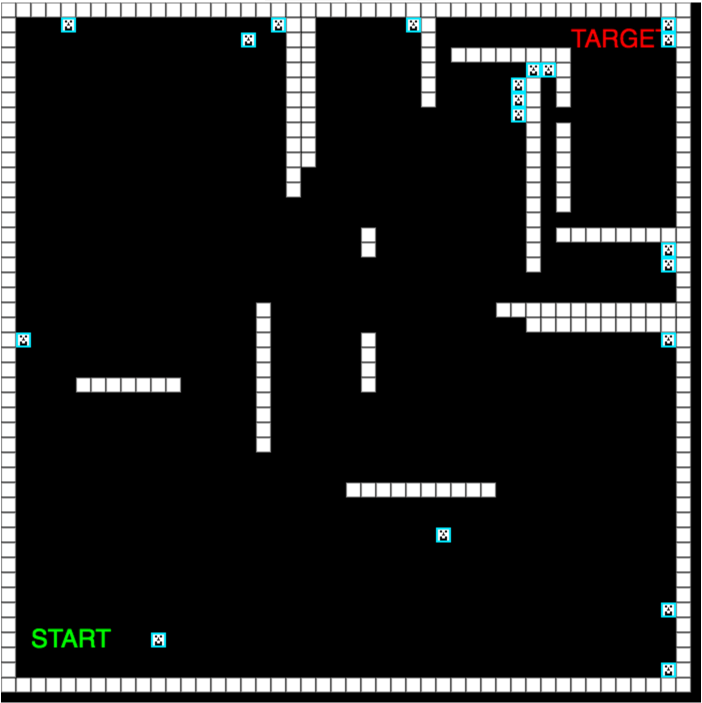

# Neuro-Evolution

Video games are some of the most used environments to test artifical intelligence.

In this specific example, we will create 100 digital creatures. They have a certain lifespan and all have their own digital brain (randomly initialized neural network). Therefore they will randomly navigate the labyrinth at first.

The goal is to have them evolve to understand how to reach the target before their life span is over.

Once their lifespan is over, a new generation of creatures is created by combining the genes of the smartest ones! In this example, the genes are the weights of the neural networks. We measure how smart they are by how close they get to the target (it is called a fitness function). This is based on Darwinism.

"Darwinism is a theory of biological evolution developed by the English naturalist Charles Darwin and others, stating that all species of organisms arise and develop through the natural selection of small, inherited variations that increase the individual's ability to compete, survive, and reproduce."
Go ahead and press the start button. You'll see that the digital babies are randomly moving at the beginning but getting smarter and closer to the target generations after generations.

If you press 'start' another time, it will reset the generation number. The digital babies might find a new way to reach the target with this new simulation...

It sometimes only takes 10 generations for most of the creatures to reach the target. Other times, many more generations are needed.

Fascinating, isn't it? This is called neuro-evolution.

